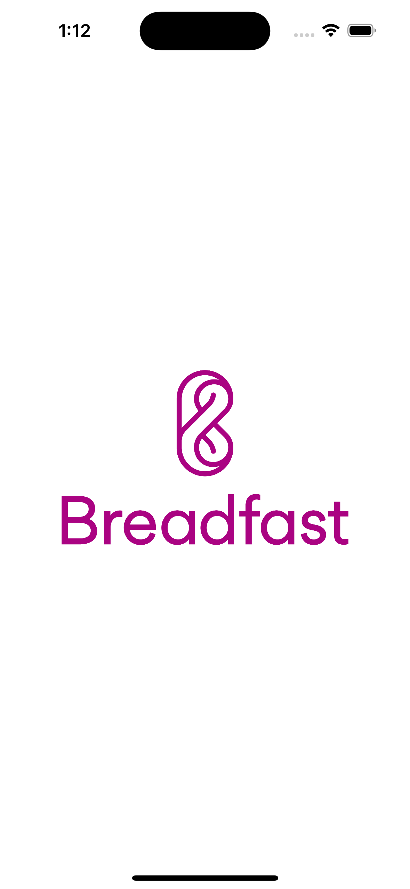
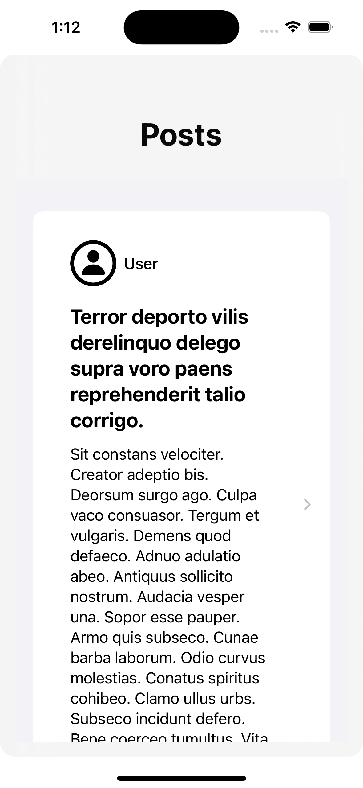
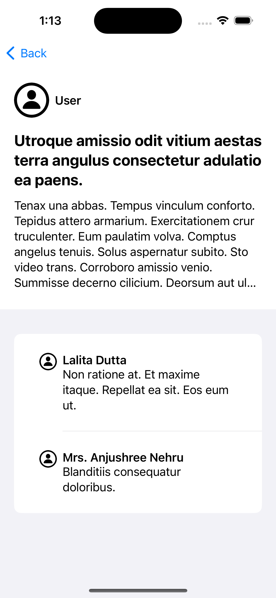

# BreadFast IOS Task

this app is to demonstrate the skills of the ios developer for senior ios developer position 

the app is created with a 3 layers 

- data
    - data access: 
        - end points : for each requet in the app it has its own object that conform to EndPoint Protocol to create a request using this object 
        - Service Handler : that handles any Api request and has the main protocol for Endpoint , 
    - Entity: contains all api responses entites to decode the json reponse into them 
    - Repository: create a new one for each apis useage to be used throw the usecases
- domain 
    - RepositoryProtocol: to add all repositories protocols needed to sperate it from the data layer and make the app this layer reusable throw other apps if need only thing is need is to impement these protocols and you ready to go 

    - Entity: entities to be used accross this layer and the presentation layer to seprate the response entites from the ui entities and each entity has its own mapper function to map an object from the response to this entity type 

    - useCase: to add a layer between the repository and the viewmodel to give access to only needed function for each view model and to split the functionality into small usecasess to be used accross the app if needed 

- presentation 
    - has folder for each view that has the view and its components , viewmodel, and coordinator 

- screenShots
 

